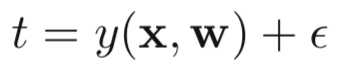

## 线性回归的形式
线性回归即由一个线性方程来拟合目标值。其形式如下：

$$
\mathrm{y}(\boldsymbol{\mathrm{x}},\boldsymbol{\mathrm{w}})=w_0 + w_1x_1 + ... + w_Dx_D
$$
其中$\boldsymbol{\mathrm{x}}=(x_1,...,x_D)^T$。

线性回归一般采用平方损失函数，即最小化样本点目标值与预测值之间差值的平方和。

## 平方损失函数的概率解释
为何使用平方损失函数可以从下面这个概率角度来理解。假定目标值$t$可以通过一个确定性方程$\mathrm{y}(\boldsymbol{\mathrm{x}},\boldsymbol{\mathrm{w}})$以及一个高斯噪声（一般都会假定观测噪声是高斯）得到：

假设噪声的

To Be Continued
