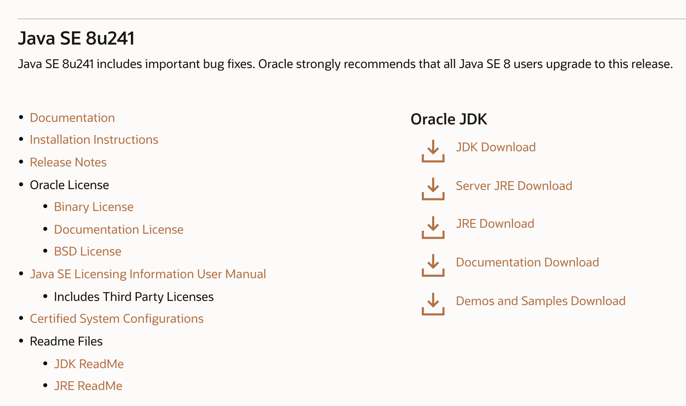
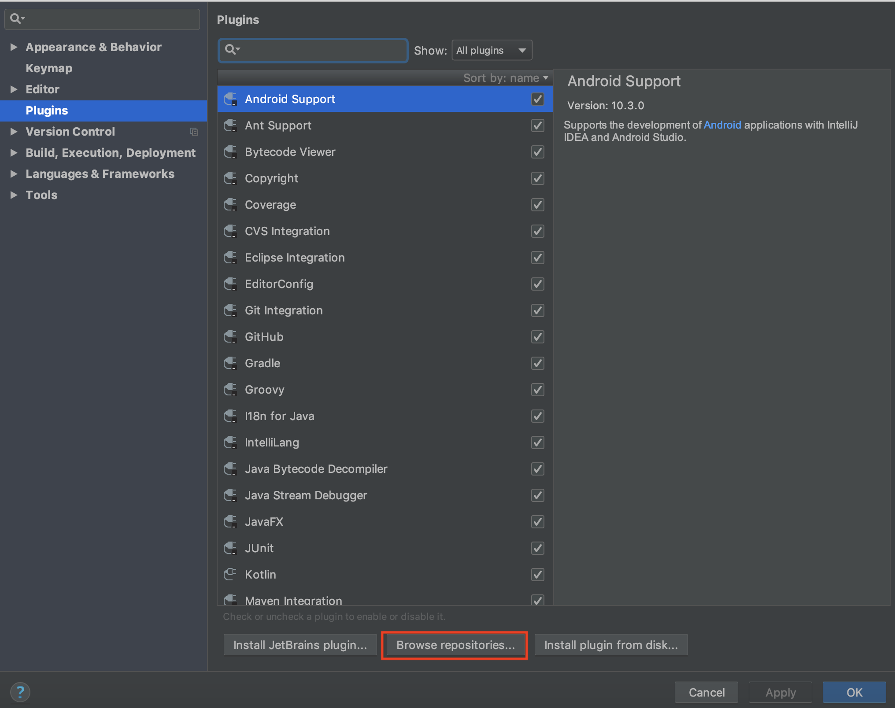
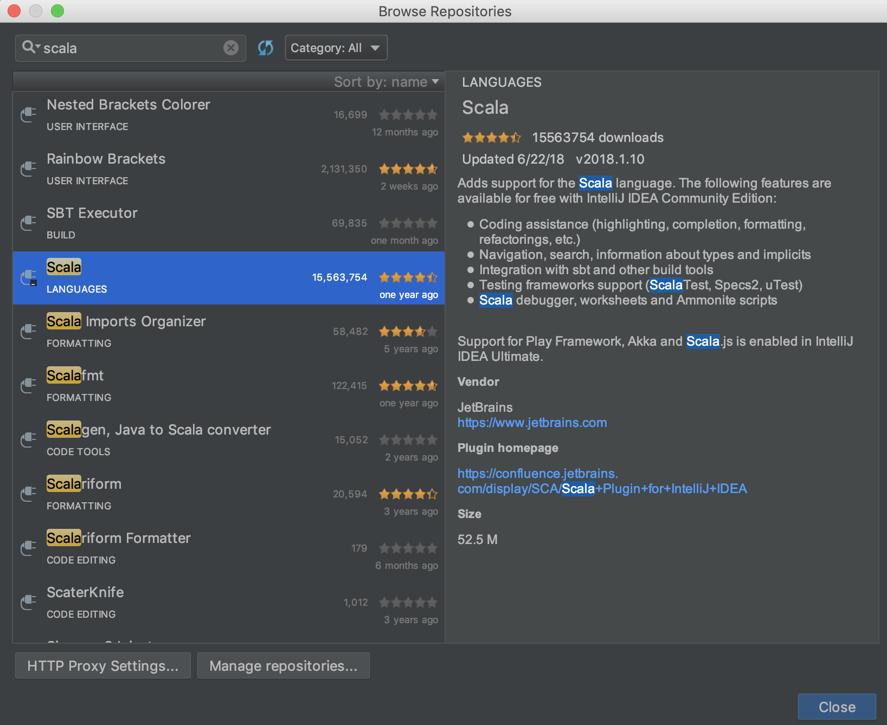
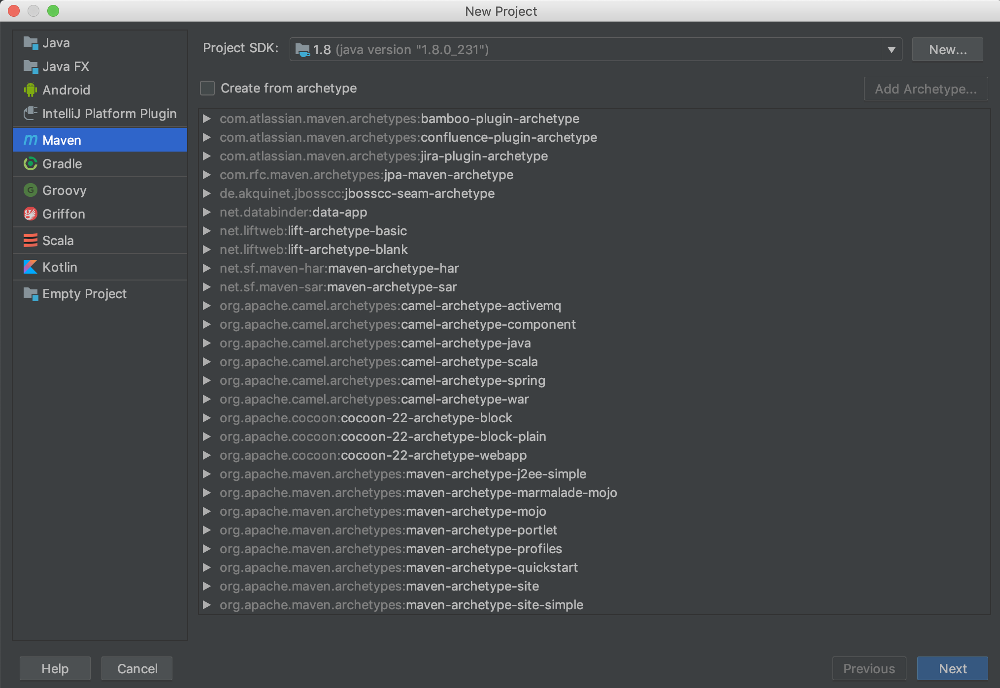
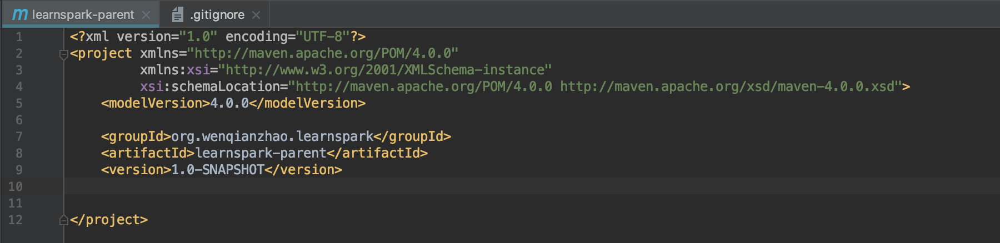
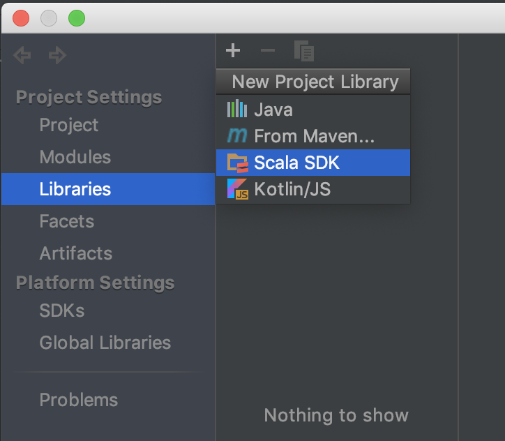
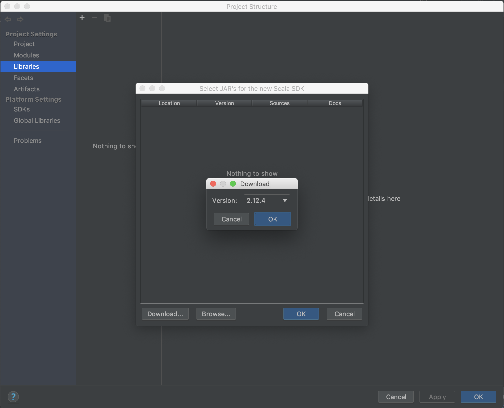
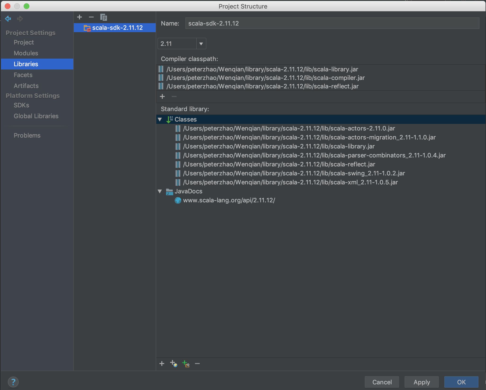

## Before All
在教程之前我想先说明一下通过本教程大家能学到什么。

### 这里说的“环境准备”是什么？
简单来说就是让你的电脑上能够运行Spark，并且可以构建依赖Spark的项目，例如自己做些小实验或者进行基于Spark的项目开发。当然，Spark本身是存在多种运行模式的，例如local、standalone和Spark on Yarn等等，那么这里说的是local模式的Spark，至于其他的模式看看之后有没有时间补充。

### 本人电脑的OS
本教程是基于macOS（macOS Mojave 10.14.6）的，在其他操作系统上类似但不完全相同。

### 我们要做些什么
在本教程中我们将完成以下几步：
1. 下载并安装开发环境（这里是Intellij IDEA）
2. 安装JDK
3. 在IDEA安装Scala插件并下载安装Scala
4. 新建一个Project并依赖Spark
5. 写一个简单的小程序并在本地运行
我会尽量详细地介绍上述几步，帮助大家更快地完成环境的搭建。

OK, let's GO!

## 开发环境准备
开发环境的推荐和介绍并不在本教程的范围内，因此我这里就不对Intellij IDEA进行更多介绍了。我们直接进入正题：
### 下载和安装
打开Intellij IDEA的[官网](https://www.jetbrains.com/idea/)，点击页面中间的**Download**进入下载页面，之后选择Community版本进行下载即可。

> 这里注意选择和你电脑相同的操作系统的版本。不过网站会检测你的电脑操作系统版本，所以一般不用调整。

下载完成之后就可以点击安装，依照向导的指示即可。

## 安装JDK
进入Oracle的[Java SE Downloads页面](https://www.oracle.com/java/technologies/javase-downloads.html)，选择合适的Java SE版本。我们这里选择*Java SE 8u241*:

点击页面中的**JDK Download**，进入下载页面。

>这里需要先注册Oracle账号并登陆后才能下载。

下载会比较慢，需要耐心等待一段时间。

## 在IDEA中安装Scala插件并下载安装Scala
打开IDEA的Preference，选择Plugin，在搜索框中输入scala。如果未搜到任何内容，那说明还没有安装插件，这时需要点击下图中红框圈出来的**Browse repositories**进行搜索，同样还是输入scala：

选择下图中的scala插件：

点击install进行安装。之后等待其安装完成即可。

下面就是安装Scala了。我们可以到Scala的[官网](https://www.scala-lang.org/download/)上下载并手动安装scala，具体的操作可以参考这篇[文章](https://www.jianshu.com/p/d7c94372020c)。

安装完scala之后可以通过在命令行输入scala进行验证：

## 新建一个Project并依赖Spark
### 新建项目
打开IDEA，选择新建Project，**Project SDK**部分应该会自动加载之前我们下载并安装好的Java SDK：

这里选择使用Maven构建项目。点击Next之后输入GroupId和ArtifactId。简单来说GroupId标识了你的组织和总的项目名称，ArtifactId标识了当前项目或子模块的名称。具体的介绍可以看一下[这篇博客](https://blog.csdn.net/qq_19934363/article/details/97612169)。

输入完GroupId和ArtifactId之后点击Next，之后输入项目的名称和位置并点击Finish即可。

新建完项目后，项目内会生成一个初始的pom文件，之后对于Spark以及其他包的依赖都会通过pom文件来完成，这里先不管它：

### 添加Scala SDK
因为项目中需要进行scala代码的编写，因此这里需要给项目添加Scala SDK的依赖。

点击File - Project Structure - Libraries，之后选择点击左上角的"+"号添加**Scala SDK**：

这里有两种方式，一种是点击**download**，选择某个版本的sdk（例如这里的2.12.4）进行下载：

不过这种方法下载的速度非常慢，并且因为我们之前已经安装好了Scala，所以再次下载就显得没必要了。那么可以怎么做呢？其实也很简单，就是在上面那一步，不再点击**download**，而是点击**browse**，并选择自己下载的安装包解压的位置（也就是scala-2.12.x那个文件夹）。点击OK后可以看到：

之后点击右下角的OK即可。

### 添加Spark依赖

To be continued...
